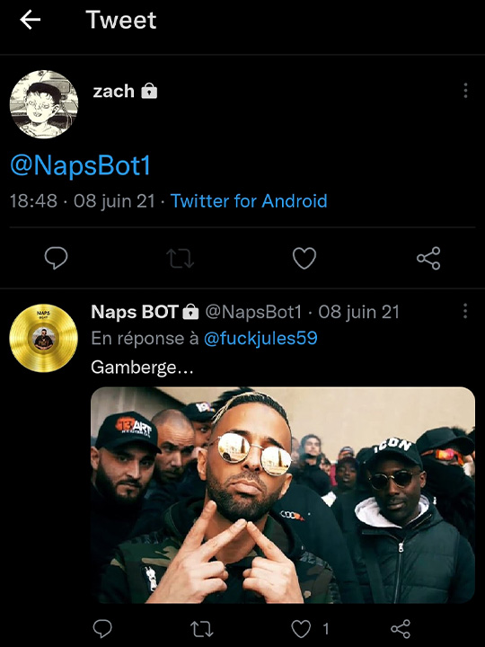

# ( Librairie nécessaire : Twitter4J )

# Indication Importante

 Veuillez remplacer les *** dans le fichier src/twitter4j.properties par des key/token Twitter API.
 
# Description
 
 BOT Twitter en JAVA, utilisation basique de réponse par une image et un message de manière automatique lorsqu'il est mentionné @NapsBot1.

 Code facilement optimisable car le BOT n'est à l'origine q'une blague entre amis. ( Exemples : choix aléatoire, nombre d'images, réponses multiples, etc... ) 
 
# Aperçu du projet 

# Auteur
 
 - Romann Cornet
